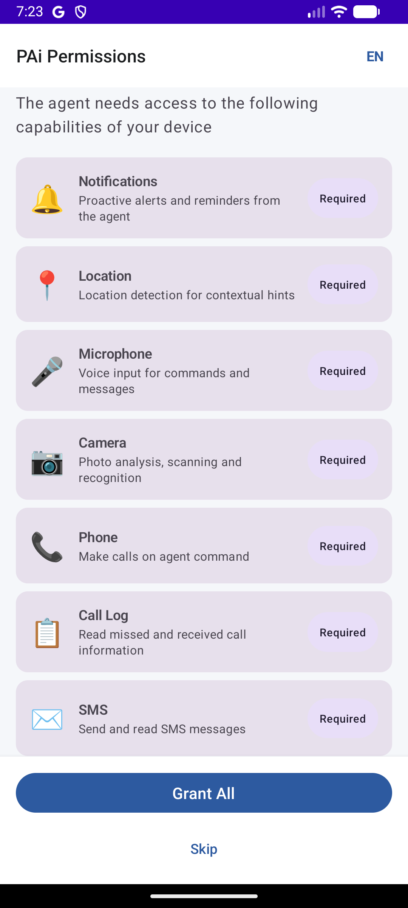
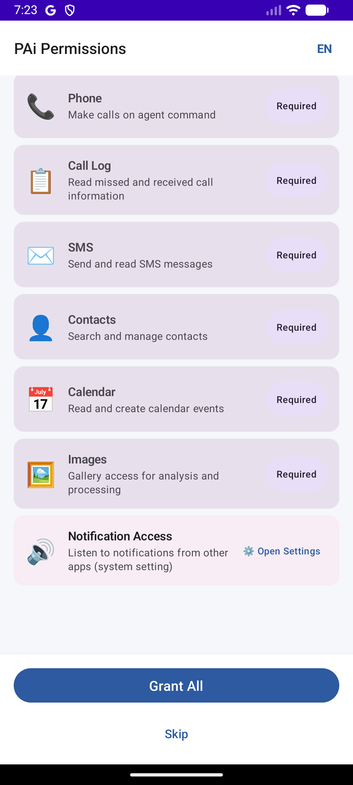
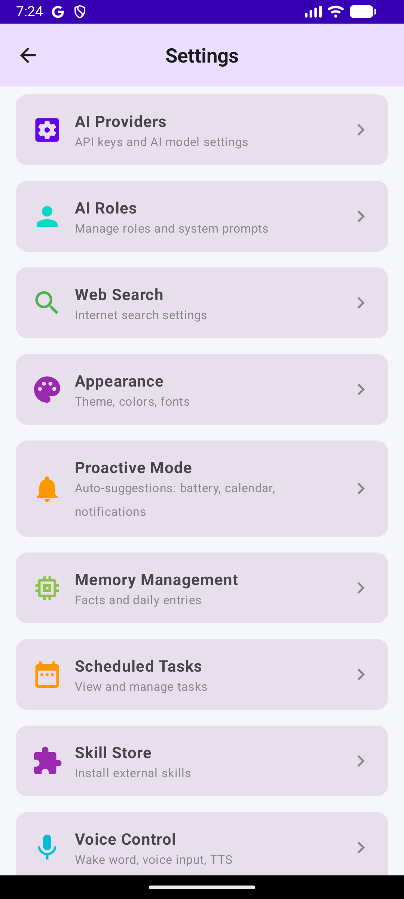
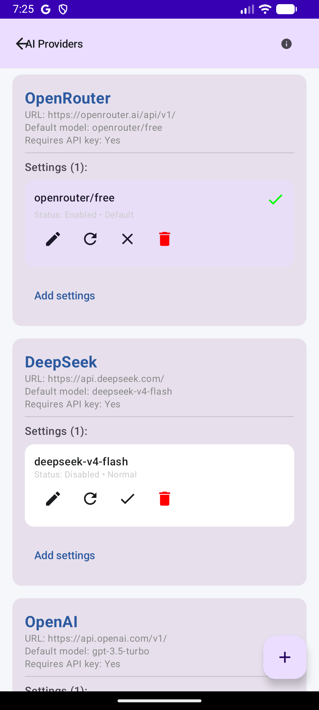
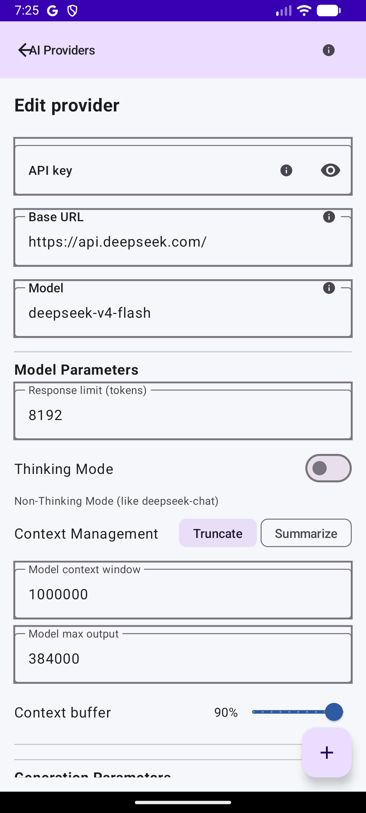

# PAi Android — AI Agent for Android

[](LICENSE)
[](https://kotlinlang.org)
[](https://developer.android.com)

**PAi Android** is a full-featured AI agent running natively on Android. Unlike cloud chatbots or simplified wrappers, PAi is a complete autonomous agent with its own decision engine, tool system, skill store, memory, scheduler, and proactive capabilities.

> ⚠️ **Status:** Active development. Core features are stable, UI is being polished. Contributions welcome!

---

## ✨ Features

### 🧠 Agent Core
- **ReAct decision loop** — Gather context → Execute tools → Respond, all driven by LLM
- **Multi-provider AI** — DeepSeek, OpenAI, OpenRouter, Ollama, Custom endpoints
- **Smart Router** — Hybrid mode: DeepSeek plans complex queries, delegates simple sub-steps to local models (Gemma, Qwen via mlc-llm or exec), DeepSeek compiles results
- **Local AI providers** — Llama.cpp, Gemma, Qwen running on-device for fast, free inference on short tasks
- **Deterministic router** — Fast command routing without LLM for common intents
- **Task queue** — Sequential async execution with auto-approval for long tasks
- **Code generation** — Generate and execute Python code from plain text queries

### 📡 Communication & Skills
- **Email** — Read, search, send, forward via IMAP/SMTP
- **SMS** — Send and read messages with auto-permission handling
- **Phone calls** — Initiate calls with runtime permission prompts
- **Contacts** — Search and manage contacts with auto-permission handling
- **App launch** — Launch any installed app by name via AI
- **Python skills** — Create, edit, and run Python scripts via LLM generation
- **News Digest** — RSS aggregation from major feeds
- **YouTube Watcher** — Video transcript analysis
- **Web search** — Google Custom Search, Tavily, built-in DuckDuckGo
- **Skill Store** — External skill marketplace with auto-install

### 📍 Location & Weather
- **GPS location** — Active and passive location via Google Play Services + fallback
- **IP geolocation** — No-permission fallback via ip-api.com
- **Reverse geocoding** — Coordinates → Address with caching
- **Weather** — Get weather by current location or city name

### 📅 Scheduler & Proactivity
- **Task scheduler** — Cron-like scheduled tasks with coroutine execution
- **Background service** — ForegroundService for Android 14+ (no background limits)
- **Proactive mode** — Battery monitoring, calendar reminders, smart notification analysis
- **Notification listener** — Real-time notification processing with importance scoring
- **Context engine** — Circular buffer of recent events fed to AI for contextual awareness
- **Notification system status** — Always included in AI context: listener active, proactive mode, forward-to-chat, buffer size

### 💾 Memory System
- **Long-term memory** — Persistent storage of facts with confidence scoring
- **Daily memory** — Automatic daily notes and summaries
- **Memory management UI** — Browse, edit, search, export, and import memory
- **Fact extraction** — Automatic extraction of personal info, preferences, events from chat

### 🛠 Extras
- **Voice control** — Vosk offline speech recognition + TTS
- **Appearance customization** — Material You dynamic colors, light/dark/system themes
- **Multi-language UI** — Russian and English interface with instant switching
- **Permissions onboarding** — First-launch wizard for 12 key permissions with "Grant All" button and system settings redirect for Notification Listener
- **Permissions in settings** — Full permissions management accessible from Settings menu for re-granting or revoking permissions after first launch
- **Scheduler tasks UI** — Browse, manage, and delete scheduled tasks from settings
- **Log Terminal** — In-app ring buffer log viewer for debugging
- **Built-in hint system** — Contextual tooltips explaining settings and features

---

## 📸 Screenshots

<div align="center">
  
  
  
  
  
</div>

---

## 📥 Download

You can download the latest debug APK directly:

| File | Size | Android | Build |
|------|------|---------|-------|
| [`PAi_Android-debug.apk`](https://github.com/Psycho051378/PAi_Android/releases/download/v1.0.0-alpha/PAi_Android-debug.apk) | ~161 MB | 14+ (API 24) | Debug |

> ⚠️ This is a **debug build** — requires `Install from unknown apps` permission.
> For a release build, clone the repo and run `./gradlew assembleRelease`.

---

## 🚀 Getting Started

### Prerequisites

**⚠️ Important: JDK 17 is REQUIRED.**

The project uses Android Gradle Plugin 8.2.0 which is **not compatible with JDK 21+** (including JetBrains Runtime 23 bundled with recent Android Studio).

- **JDK 17** — Download from [Eclipse Adoptium](https://adoptium.net/temurin/releases/?version=17)
- Android Studio Hedgehog (2023.1.1+) or later
- Android SDK 34+
- A physical device or emulator running Android 14+

> **Windows users:** If you get a `jlink.exe` error during build, go to
> `File → Settings → Build, Execution, Deployment → Build Tools → Gradle`
> and set **Gradle JDK** to your JDK 17 installation.

### Build & Install

```bash
# Clone the repository
git clone https://github.com/Psycho051378/PAi_Android.git
cd pai-android

# Build debug APK
./gradlew assembleDebug

# Or build and install directly
./gradlew installDebug
```

### First Run
1. **Permissions Onboarding** — On first launch, you'll see a permissions wizard listing all 12 required permissions with icons and descriptions:
   - Notifications, Location, Microphone, Camera, Phone, Call Log
   - SMS, Contacts, Calendar, Images (Android 13+), Notification Listener
   - Tap **"Grant All"** to request all runtime permissions at once, or grant individually
   - For **Notification Listener**, you'll be redirected to system settings
   - A **language switch** (RU/EN) is available in the top bar
   - Once all permissions are granted, tap **"Continue"** to enter the app
   - You can **skip** the wizard — agent features requiring those permissions will be limited
2. Go to **Settings → AI Providers** to configure your API key
3. Start chatting! The AI agent will use your configured provider

---

## 🔧 Configuration

### AI Providers
The app supports multiple AI backends. API keys are stored locally and never sent anywhere:

| Provider | Default Model | API Key Required | URL |
|----------|--------------|-----------------|-----|
| DeepSeek | `deepseek-v4-flash` | ✅ | [platform.deepseek.com](https://platform.deepseek.com) |
| OpenAI | `gpt-3.5-turbo` | ✅ | [platform.openai.com](https://platform.openai.com) |
| OpenRouter | `openrouter/free` | ✅ | [openrouter.ai](https://openrouter.ai) |
| Ollama | `llama2` | ❌ | Runs locally on device/network |
| Local AI | `llama.cpp`, `gemma`, `qwen` | ❌ | On-device inference via mlc-llm or exec |

Smart Router can be configured in **Settings → Smart Router**:
- Toggle hybrid mode on/off
- Set complexity threshold for cloud routing
- Configure fallback to local model on network errors
- Multimodal queries can be routed to local models

### Skills
External skills can be installed from the built-in Skill Store. Skills are fetched from a remote manifest and executed on-device.

---

## 🏗 Architecture

```
com.pai.android/
├── agent/
│   ├── DecisionEngine.kt      # Main decision loop (ReAct)
│   ├── TaskScheduler.kt       # Cron-like task scheduling
│   ├── tools/                  # Tool implementations (fetch, codegen, location...)
│   ├── skills/                 # Built-in skills (email, sms, call, weather...)
│   └── SkillRegistry.kt       # Central skill management
├── data/
│   ├── local/                  # Room database, DAOs
│   ├── model/                  # Data models
│   ├── repository/             # Data repositories
│   └── detector/               # Intent/fact detection
├── presentation/               # ViewModels
├── ui/
│   ├── screens/                # Compose screens
│   ├── components/             # Reusable UI components
│   └── navigation/             # Navigation graph
├── di/                         # Hilt dependency injection
└── service/                    # Background services
```

---

## 🧪 Tech Stack

| Layer | Technology |
|-------|-----------|
| Language | Kotlin 2.0+ |
| UI | Jetpack Compose, Material3 |
| DI | Hilt |
| Database | Room |
| Architecture | MVVM + Unidirectional data flow |
| AI | OpenAI-compatible API (DeepSeek, OpenAI, OpenRouter) |
| Speech | Vosk (offline recognition) |
| Background | ForegroundService |

---

## 📄 License

```
Copyright 2026 PAi Android

Licensed under the Apache License, Version 2.0 (the "License");
you may not use this file except in compliance with the License.
You may obtain a copy of the License at

    http://www.apache.org/licenses/LICENSE-2.0

Unless required by applicable law or agreed to in writing, software
distributed under the License is distributed on an "AS IS" BASIS,
WITHOUT WARRANTIES OR CONDITIONS OF ANY KIND, either express or implied.
See the License for the specific language governing permissions and
limitations under the License.
```

---

## 🤝 Contributing

Contributions are welcome! This is a personal project in active development.

- **Bug reports / feature requests** — Open an issue
- **Pull requests** — Please ensure brace balance and existing tests pass
- **Questions** — Reach out via the project's GitHub Discussions

---

## 🙏 Acknowledgements

- [DeepSeek](https://deepseek.com) for their excellent API
- [Vosk](https://alphacephei.com/vosk/) for offline speech recognition
- All open-source libraries used in this project
