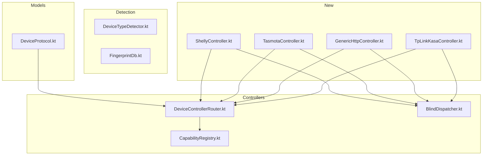

# План расширения умного дома — Спринт 1 и Спринт 2

## Архитектурный контекст

В проекте уже заложены **два режима работы** контроллеров:

| Режим | Когда используется | Как работает |
|-------|-------------------|--------------|
| **Addressable** | Есть база устройств (MAC, IP, протокол) | SmartHomeDispatcher → DeviceControllerRouter → XxxController.turnOn(ip, port) |
| **Blind** | Сети нет в базе / нет управляемых устройств | BlindDispatcher → broadcast / probe всей подсети |

Существующие протоколы и их режимы:

| Протокол | Addressable | Blind |
|----------|-------------|-------|
| YEELIGHT | YeelightController (TCP 55443) | BlindDispatcher → ping sweep + probe 55443 |
| WIZ | WizController (UDP 38899) | BlindDispatcher → broadcast 255.255.255.255:38899 |
| MIIO / ROBOROCK | MiioController (Python/Chaquopy) | Нет |

---

## Спринт 1 — «Быстрые победы» (чистый Kotlin)

### 1.1 ShellyController

**Протоколы устройств Shelly:**

| Поколение | Примеры | Протокол | Порт |
|-----------|---------|----------|------|
| Gen1 | Shelly 1, 1PM, 2.5, RGBW2, Dimmer, Bulb | HTTP GET | 80 |
| Gen2/Gen3 | Shelly Plus 1, Plus 2PM, Pro 4PM, BLU Gateway | HTTP POST RPC | 80 |

#### Addressable mode

**Gen1 — HTTP GET:**
```
Вкл:    GET http://{ip}/relay/0?turn=on
Выкл:   GET http://{ip}/relay/0?turn=off
Статус: GET http://{ip}/relay/0  → {"ison":true,...}
Ярк:    GET http://{ip}/light/0?brightness=50&turn=on    (Dimmer)
Цвет:   GET http://{ip}/color/0?red=255&green=0&blue=0   (RGBW2)
```

**Gen2/Gen3 — HTTP POST RPC:**
```
Вкл:    POST http://{ip}/rpc/Switch.Set {"id":0,"on":true}
Выкл:   POST http://{ip}/rpc/Switch.Set {"id":0,"on":false}
Статус: POST http://{ip}/rpc/Switch.GetStatus {"id":0}
Ярк:    POST http://{ip}/rpc/Light.Set {"id":0,"on":true,"brightness":50}
Цвет:   POST http://{ip}/rpc/Light.Set {"id":0,"on":true,"red":255,"green":0,"blue":0}
Инфо:   GET  http://{ip}/rpc/Shelly.GetDeviceInfo  → {"name":"...","mac":"...",...}
```

**Поддержка жалюзи (Shelly 2.5 в режиме roller / Shelly Plus 2PM):**
```
Открыть: GET http://{ip}/roller/0?go=open
Закрыть: GET http://{ip}/roller/0?go=close
Стоп:    GET http://{ip}/roller/0?go=stop
```

#### Blind mode

1. **Сканирование:** TCP sweep порта 80 по подсети
2. **Идентификация:** На каждый открытый 80 порт → GET `/rpc/Shelly.GetDeviceInfo` (Gen2+) или проверка HTTP-заголовка `Server: SHELLY-...` (Gen1)
3. **Probe-команда:** Если не удалось идентифицировать — пробуем отправить команду на `/relay/0?turn=on` и проверяем ответ

#### Что изменить

| Файл | Изменение |
|------|-----------|
| **DeviceProtocol.kt** | Уже есть TASMOTA — добавить `SHELLY("Shelly")` |
| **ShellyController.kt** | Новый файл: implement DeviceController + Gen1/Gen2 dispatch |
| **DeviceControllerRouter.kt** | Добавить `"SHELLY" to shellyController` |
| **BlindDispatcher.kt** | Добавить метод `blindShelly(action, params, ips)` + вызов из `dispatch()` |
| **DeviceTypeDetector.kt** | Добавить детекцию Shelly по HTTP fingerprint |
| **CapabilityRegistry.kt** | Добавить `SHELLY` в `getProtocolFeatures()` — POWER, BRIGHTNESS, RGB, COLOR_TEMP |
| **FingerprintDb.kt** | Добавить OUI Shelly (MAC: 2C:3F:38, EC:FA:BC, A4:C1:38, 94:B9:7E) |

#### Файлы для создания
- `ShellyController.kt`

#### Файлы для изменения
- `DeviceProtocol.kt`
- `DeviceControllerRouter.kt`
- `BlindDispatcher.kt`
- `DeviceTypeDetector.kt`
- `CapabilityRegistry.kt`
- `FingerprintDb.kt`

---

### 1.2 TasmotaController

**Протокол:**
- HTTP GET на порт 80
- Команды: `/cm?cmnd=...`
- Статус: HTTP JSON через `/cm?cmnd=Status%200`

#### Addressable mode

```
Вкл:    GET http://{ip}/cm?cmnd=Power%20ON         → {"POWER":"ON"}
Выкл:   GET http://{ip}/cm?cmnd=Power%20OFF        → {"POWER":"OFF"}
Статус: GET http://{ip}/cm?cmnd=Status%200          → {"Status":{"Power":1,"Dimmer":50,...}}
Ярк:    GET http://{ip}/cm?cmnd=Dimmer%2050          → {"Dimmer":50}
Цвет:   GET http://{ip}/cm?cmnd=Color%2000FF00       → {"Color":"00FF00"}
ЦТемп:  GET http://{ip}/cm?cmnd=CTemp%20350          → {"CTemp":350}  (Tasmota: 200-500 = 2000K-6500K)
```

**Поддержка цветовой температуры в Tasmota:**
- Значение 200-500 (масштабируется в 2000K-6500K)
- Команда: `CTemp 350` → ~3500K
- При конвертации: `tasmotaTemp = (kelvin - 2000) / 9` (или по формуле точнее)

#### Blind mode

1. **Сканирование:** TCP sweep порта 80
2. **Идентификация:** получить `/cm?cmnd=Status%200` → парсить JSON на наличие `"Tasmota"` в `StatusFWR.version` или заголовок `Server: Tasmota/...`
3. **Probe-команда:** Если не идентифицировано — пробуем `Power ON` на все живые хосты с портом 80

#### Что изменить

| Файл | Изменение |
|------|-----------|
| **TasmotaController.kt** | Новый файл: implement DeviceController (HTTP GET /cm) |
| **DeviceControllerRouter.kt** | Добавить `"TASMOTA" to tasmotaController` |
| **BlindDispatcher.kt** | Добавить `blindTasmota(action, params, ips)` + вызов из `dispatch()` |
| **CapabilityRegistry.kt** | TASMOTA уже есть в getProtocolFeatures — проверить, что всё покрыто |
| **FingerprintDb.kt** | OUI Sonoff: 64:6A:DA, B4:E6:44, EC:FA:BC |

#### Файлы для создания
- `TasmotaController.kt`

#### Файлы для изменения
- `DeviceControllerRouter.kt`
- `BlindDispatcher.kt`
- `CapabilityRegistry.kt`
- `FingerprintDb.kt`

---

### 1.3 GenericHttpController + WLED

**Идея:** Универсальный контроллер для DIY-устройств и мелких брендов, у которых есть простой HTTP API, но нет отдельного контроллера. Пользователь задаёт шаблоны URL.

#### Addressable mode

Расширяем `deviceConfig` (JSON в SmartHomeDevice) для хранения шаблонов:

```json
{
  "http_on": "POST http://{ip}/on",
  "http_off": "POST http://{ip}/off",
  "http_status": "GET http://{ip}/status",
  "http_brightness": "POST http://{ip}/brightness?level={level}",
  "http_rgb": "POST http://{ip}/color?r={r}&g={g}&b={b}",
  "response_parser": "json",
  "status_path_json": "$.state",
  "status_power_key": "state",
  "status_brightness_key": "brightness",
  "status_rgb_keys": ["r","g","b"]
}
```

GenericHttpController должен:
1. Читать шаблоны из `deviceConfig`
2. Подставлять `{ip}`, `{level}`, `{r}`, `{g}`, `{b}` в URL
3. Выполнять HTTP запрос
4. Парсить ответ (JSON, текст)

#### WLED — отдельный профиль внутри GenericHttpController

WLED (прошивка для адресных LED-лент WS2812B) — самый популярный DIY-освещение:

```
Вкл/Выкл:  GET http://{ip}/win&T=1  /  /win&T=0
Яркость:   GET http://{ip}/win&A=50
Цвет:      GET http://{ip}/win&R=255&G=0&B=0
Эффект:    GET http://{ip}/win&FX=0  (1-100+)
Статус:    GET http://{ip}/json/state  → {"on":true,"bri":128,...}
```

WLED детектится по:
- HTTP заголовок `Server: WLED/...` или `wled`
- Ответ на GET `/json/info` содержит `"name":"WLED"`
- MAC OUI: Espressif (Tasmota/WLED часто на ESP)

#### Blind mode

1. **Сканирование:** TCP sweep порта 80
2. **Идентификация:** GET `/json/info` → ищем `"wled"` в ответе
3. **Детекция Generic HTTP:** если на `deviceConfig` указан шаблон для проверки — проверяем по нему

#### Что изменить

| Файл | Изменение |
|------|-----------|
| **GenericHttpController.kt** | Новый файл: implement DeviceController + чтение шаблонов из deviceConfig |
| **WledController.kt** (опционально) | Можно как отдельный, можно как предконфиг для GenericHttpController |
| **DeviceControllerRouter.kt** | Добавить `"GENERIC_HTTP" to genericHttpController`, `"WLED" to genericHttpController` |
| **BlindDispatcher.kt** | WLED blind probe через `/json/info` |
| **DeviceProtocol.kt** | Добавить `GENERIC_HTTP("Generic HTTP")` и/или `WLED("WLED")` |

#### Файлы для создания
- `GenericHttpController.kt`

#### Файлы для изменения
- `DeviceProtocol.kt`
- `DeviceControllerRouter.kt`
- `BlindDispatcher.kt`

---

## Спринт 2 — «Тяжёлая артиллерия» (через Chaquopy / Python)

### 2.1 TpLinkKasaController

**Протоколы TP-Link:**

| Поколение | Примеры | Протокол | Порт |
|-----------|---------|----------|------|
| Kasa (старые) | HS100, KL130, KL125 | Шифрованный TCP (TP-Link Smart Home Protocol) | 9999 |
| Tapo (новые) | L530, L630, P100 | KLAP (AES-CBC-SHA256 over HTTP) | 80 |

Оба протокола покрывает библиотека `python-kasa`.

#### Addressable mode

Управление через Chaquopy → python-kasa:

```python
# Пример python-kasa кода
import asyncio
from kasa import Device

async def control(ip, action, params_json):
    device = Device(ip)
    await device.update()
    if action == "turn_on":
        await device.turn_on()
    elif action == "turn_off":
        await device.turn_off()
    elif action == "set_brightness":
        await device.set_brightness(params["level"])
    elif action == "set_rgb":
        # python-kasa использует HSV
        h, s, v = rgb_to_hsv(r, g, b)
        await device.set_hsv(h, s, v)
    elif action == "set_color_temp":
        await device.set_color_temp(params["temp"])
    elif action == "get_status":
        return {"on": device.is_on, "brightness": device.brightness}
```

**Важно:** python-kasa использует HSV, не RGB. Потребуется конвертация RGB→HSV на стороне Kotlin или Python-скрипта.

**Credential management:**
- Новые Tapo требуют username/password (учётка TP-Link)
- В проекте уже есть `deviceConfig` — туда сохраняем `{"tapo_user":"...","tapo_pass":"..."}` для каждого устройства или глобально

#### Blind mode

1. **Сканирование (через python-kasa):**
   ```python
   from kasa import Discover
   devices = await Discover.discover()
   # Возвращает список {"ip": ..., "mac": ..., "model": ...}
   ```

2. **Метод:** UDP broadcast discovery на адрес подсети. python-kasa шлёт пакет на broadcast и ждёт ответы 3 секунды.

3. **Интеграция в BlindDispatcher:**
   - Если Chaquopy доступен → запускаем Kasa discovery
   - Получаем список IP + модель
   - Отправляем команду на все найденные устройства

#### Что изменить

| Файл | Изменение |
|------|-----------|
| **TpLinkKasaController.kt** | Новый файл: implement DeviceController → Chaquopy → python-kasa |
| **DeviceControllerRouter.kt** | Добавить `"TPLINK_KASA" to tpLinkKasaController` |
| **BlindDispatcher.kt** | Добавить `blindTpLinkKasa(action, params)` через Chaquopy |
| **DeviceProtocol.kt** | Добавить `TPLINK_KASA("TP-Link Kasa/Tapo")` |
| **CapabilityRegistry.kt** | Добавить `TPLINK_KASA` в getProtocolFeatures — POWER, BRIGHTNESS, RGB, COLOR_TEMP, STATUS |
| **miio_control.py** (или новый файл) | Создать `kasa_control.py` с Python-функциями для управления |
| **app/build.gradle** | Возможно, добавить python-kasa в requirements (если через pip) |

**Credential flow:**
- При первом обнаружении Tapo-устройства → запросить у пользователя TP-Link credentials
- Сохранить в `deviceConfig` как `{"tapo_user":"...","tapo_pass":"..."}`
- При каждой команде передавать credentials в python-kasa

#### Файлы для создания
- `TpLinkKasaController.kt`
- `kasa_control.py` (Python-скрипт)

#### Файлы для изменения
- `DeviceProtocol.kt`
- `DeviceControllerRouter.kt`
- `BlindDispatcher.kt`
- `CapabilityRegistry.kt`

---

## Сводная таблица изменений по файлам

### Новые файлы

```
app/src/main/java/.../device/
├── ShellyController.kt          # HTTP/RPC управление Shelly
├── TasmotaController.kt         # HTTP/cm управление Tasmota
├── GenericHttpController.kt     # Шаблонный HTTP-контроллер
├── TpLinkKasaController.kt      # Chaquopy → python-kasa

app/src/main/java/.../
├── kasa_control.py              # Python-скрипт для Kasa/Tapo
```

### Изменяемые файлы



---

## Приоритет внутри спринтов

| # | Задача | Дней | Почему в таком порядке |
|---|--------|------|----------------------|
| **Спринт 1** |
| 1.1 | ShellyController | 2 | Самый простой HTTP API, большой рынок, обе генерации |
| 1.2 | TasmotaController | 1 | Очень простой, похож на Shelly кодом |
| 1.3 | GenericHttpController + WLED | 2 | Покрывает DIY, не требует новых протоколов |
| **Спринт 2** |
| 2.1 | TpLinkKasaController | 3 | Сложный (Chaquopy + python-kasa + credentials), но самый массовый |

---

## Принцип работы BlindDispatcher — расширение

Текущий BlindDispatcher:
```
dispath(action, params) →
    1. WiZ broadcast (всегда)
    2. Yeelight blind probe (TCP sweep 55443)
```

После расширения:
```
dispath(action, params) →
    1. WiZ broadcast (UDP 38899)              — существующий
    2. Yeelight blind probe (TCP 55443)       — существующий
    3. Shelly blind probe (TCP 80 + RPC)      — новый
    4. Tasmota blind probe (TCP 80 + cmnd)    — новый
    5. Kasa blind probe (UDP broadcast)       — новый
```

**Метод dispatchQuery уже парсит через ControlIntentParser** — он остаётся, просто добавляем вызовы новых probe.

Для оптимизации:
- **TCP-порт 80** — общий для Shelly, Tasmota, WLED и ещё сотни устройств
  - При сканировании порта 80 один раз → проверяем все три протокола последовательно
  - HTTP probe на каждый IP → парсим ответ: Shelly? Tasmota? WLED? Generic HTTP?
- **UDP broadcast** (Kasa discovery) — отдельно, параллельно TCP sweep

---

## Детекция при сканировании (DeviceTypeDetector)

Нужно дополнить существующую детекцию новыми сигнатурами:

| Протокол | Признак |
|----------|---------|
| Shelly Gen1 | HTTP заголовок `Server: SHELLY-...` (например `Server: SHELLY-RGBW2`) |
| Shelly Gen2 | GET `/rpc/Shelly.GetDeviceInfo` возвращает JSON с `"app":"Shelly"` |
| Tasmota | GET `/cm?cmnd=Status%200` → JSON содержит `"Tasmota"` в version |
| WLED | GET `/json/info` → JSON содержит `"name":"WLED"` |
| Kasa/Tapo | UDP broadcast discovery (через python-kasa) |
